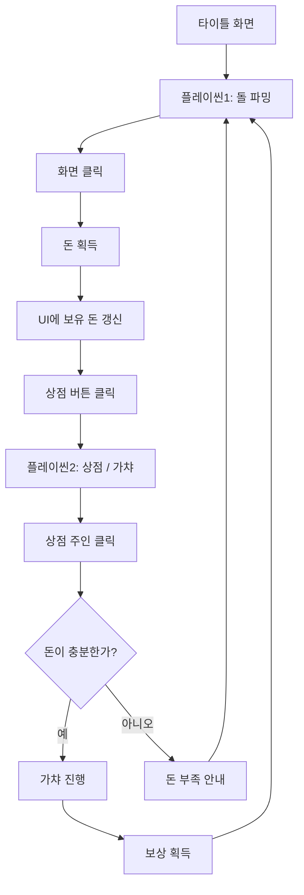
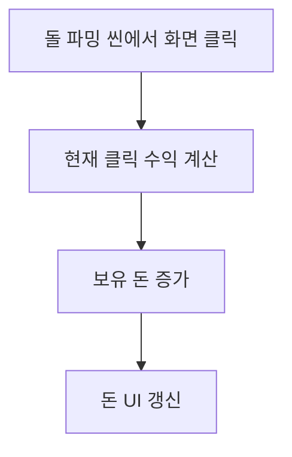
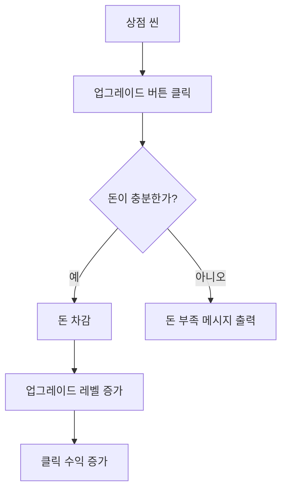

# 돌 파밍으로 돈을 모아 가챠로 성공 - 게임 기획서

## 1. 게임 개요

| 항목 | 내용 |
|---|---|
| 게임명 | 돌 파밍으로 돈을 모아 가챠로 성공 |
| 장르 | 클릭커 / 방치형 / 가챠 수집 게임 |
| 플랫폼 | PC |
| 그래픽 방식 | Direct2D 기반 2D 스프라이트 게임 |
| 플레이 방식 | 화면 클릭으로 재화를 획득하고, 획득한 돈으로 가챠를 진행하여 보상을 얻는 구조 |
| 개발 인원 | 2명 |
| 개발 구조 | 엔진 파트 / 컨텐츠 파트 분리 개발 |

## 2. 게임 콘셉트

플레이어는 돌멩이를 클릭하거나 화면을 클릭하여 돈을 모은다. 모은 돈은 상점에서 가챠를 진행하는 데 사용된다. 
가챠를 통해 다양한 아이템을 획득하고, 추후에는 획득한 아이템을 인벤토리에 저장하거나 클릭 수익을 증가시키는 성장 요소로 확장할 수 있다.

핵심 재미는 다음과 같다.

- 단순한 클릭으로 돈을 버는 즉각적인 보상감
- 돈을 모아 가챠를 시도하는 기대감
- 가챠 결과에 따른 수집 및 성장 가능성
- 향후 인벤토리, 강화, 자동 수익 등으로 확장 가능한 구조

## 3. 핵심 게임 루프



## 4. 씬 구성

### 4.1 타이틀 씬

#### 목적

게임 시작 전 첫 화면으로, 게임의 분위기를 보여주고 플레이씬으로 진입하는 역할을 한다.

#### 화면 구성

| 요소 | 설명 |
|---|---|
| 게임 이름 스프라이트 | 화면 상단에 배치되며, 위아래로 천천히 움직인다. 떠다니는 듯한 연출이 핵심이다. |
| 시작 버튼 | 버튼을 클릭하면 플레이씬1로 전환된다. |
| 배경 | 단순한 배경 이미지 또는 색상 배경을 사용한다. |

#### 주요 연출

- 게임 이름 스프라이트는 `sin` 또는 누적 시간 기반으로 y좌표를 천천히 변화시킨다.
- 이동 속도는 느리게 설정하여 떠다니는 느낌을 만든다.
- 버튼 클릭 시 즉시 플레이씬1로 이동한다.

#### 필요 기능

- 타이틀 로고 스프라이트 출력
- 로고 부유 애니메이션
- 버튼 충돌 또는 클릭 판정
- 씬 전환 기능

---

### 4.2 플레이씬1 - 돌 파밍 씬

#### 목적

플레이어가 화면을 클릭하여 돈을 버는 메인 파밍 씬이다.

#### 화면 구성

| 요소 | 위치 | 설명 |
|---|---|---|
| 돌멩이 스프라이트 | 화면 중앙 | 게임의 주요 상징 오브젝트. 클릭 수익의 대상처럼 보이도록 배치한다. |
| 화면 전체 콜라이더 | 화면 전체 | 화면 어디를 클릭해도 돈을 획득할 수 있도록 한다. |
| 보유 돈 UI | 화면 우측 상단 | 현재까지 번 돈을 표시한다. |
| 상점 버튼 | 화면 좌측 | 클릭 시 플레이씬2로 이동한다. |

#### 기본 규칙

- 플레이어가 화면 아무 곳이나 클릭하면 돈이 증가한다.
- 기본 클릭 수익은 1원으로 시작한다.
- 클릭할 때마다 우측 상단 UI의 돈 표시가 즉시 갱신된다.
- 좌측 상점 버튼을 클릭하면 플레이씬2로 이동한다.

#### 필요 기능

- 화면 전체 클릭 판정
- 돈 증가 로직
- 보유 돈 UI 출력 및 갱신
- 돌멩이 스프라이트 출력
- 상점 버튼 클릭 판정
- 플레이씬2로 씬 전환

#### 클릭 처리 우선순위

상점 버튼이 화면 전체 클릭 콜라이더보다 우선되어야 한다.

1. 상점 버튼 클릭 여부 확인
2. 상점 버튼을 클릭했다면 플레이씬2로 이동
3. 상점 버튼이 아니라면 일반 클릭으로 처리하여 돈 증가

이 처리를 하지 않으면 상점 버튼을 누를 때도 돈이 같이 증가할 수 있다.

---

### 4.3 플레이씬2 - 상점 / 가챠 씬

#### 목적

플레이어가 플레이씬1에서 번 돈을 사용해 가챠를 진행하는 씬이다.

#### 화면 구성

| 요소 | 위치 | 설명 |
|---|---|---|
| 상점 주인 스프라이트 | 화면 중앙 또는 좌측 중앙 | 클릭 시 가챠를 진행하는 주요 상호작용 대상이다. |
| 보유 돈 UI | 화면 우측 상단 | 현재 보유 돈을 표시한다. |
| 확률 정보 버튼 | 화면 일부 | 클릭 시 가챠 확률 정보를 확인할 수 있다. |
| 돌아가기 버튼 | 화면 좌측 또는 하단 | 플레이씬1로 복귀한다. |

#### 기본 규칙

- 상점 주인을 클릭하면 가챠를 진행한다.
- 가챠 1회 비용은 초기값으로 10원으로 설정한다.
- 보유 돈이 비용보다 적으면 가챠를 진행하지 않고 돈 부족 안내를 출력한다.
- 보유 돈이 충분하면 비용을 차감하고 가챠 결과를 출력한다.
- 확률 정보 버튼을 클릭하면 가챠 확률표를 보여준다.

#### 필요 기능

- 상점 주인 클릭 판정
- 가챠 비용 확인
- 돈 차감 로직
- 랜덤 보상 추첨 로직
- 가챠 결과 출력 UI
- 확률 정보 UI 열람 기능
- 플레이씬1로 돌아가기 기능

## 5. 가챠 시스템 기획

### 5.1 기본 가챠 비용

| 항목 | 값 |
|---|---:|
| 1회 뽑기 비용 | 10원 |
| 초기 클릭 수익 | 클릭당 1원 |

### 5.2 기본 가챠 확률 예시

| 등급 | 확률 | 예시 아이템 |
|---|---:|---|
| 일반 | 60% | 평범한 돌, 작은 조약돌 |
| 희귀 | 30% | 반짝이는 돌, 단단한 돌 |
| 영웅 | 9% | 황금빛 돌, 고대의 돌 |
| 전설 | 1% | 운명의 돌, 성공의 돌 |

### 5.3 가챠 결과 처리

초기 버전에서는 가챠 결과를 화면에 텍스트 또는 간단한 결과 UI로 표시한다.

예시:

```text
가챠 결과: 반짝이는 돌 획득!
```

향후 확장 시 결과 아이템은 인벤토리에 저장되며, 아이템 효과를 통해 클릭 수익을 증가시킬 수 있다.

## 6. UI 기획

### 6.1 공통 UI

| UI | 설명 |
|---|---|
| 보유 돈 표시 | 현재 플레이어가 가진 돈을 표시한다. |
| 버튼 UI | 씬 전환, 가챠, 확률 정보 열람 등에 사용된다. |
| 안내 메시지 | 돈 부족, 가챠 결과, 확률 정보 등을 표시한다. |

### 6.2 플레이씬1 UI

- 우측 상단: 보유 돈 표시
- 좌측: 상점 이동 버튼
- 중앙: 돌멩이 스프라이트

### 6.3 플레이씬2 UI

- 우측 상단: 보유 돈 표시
- 중앙: 상점 주인 스프라이트
- 특정 위치: 확률 정보 버튼
- 좌측 또는 하단: 돌아가기 버튼
- 중앙 또는 하단: 가챠 결과 메시지

## 7. 데이터 설계

### 7.1 플레이어 데이터

| 변수명 예시 | 타입 | 설명 |
|---|---|---|
| money | int | 현재 보유 돈 |
| clickValue | int | 클릭 1회당 획득하는 돈 |
| gachaCost | int | 가챠 1회 비용 |

### 7.2 가챠 아이템 데이터

| 변수명 예시 | 타입 | 설명 |
|---|---|---|
| itemId | int | 아이템 고유 ID |
| itemName | string | 아이템 이름 |
| grade | enum/string | 아이템 등급 |
| probability | float | 등장 확률 |
| effectValue | int | 향후 클릭 수익 증가 등에 사용할 효과 수치 |

### 7.3 씬 데이터

| 씬 이름 | 설명 |
|---|---|
| TitleScene | 타이틀 화면 |
| PlayScene1 | 돌 파밍 화면 |
| PlayScene2 | 상점 / 가챠 화면 |

## 8. 개발 파트 분리

## 8.1 엔진 파트

엔진 파트는 Direct2D 기반 게임 프레임워크와 공통 시스템을 담당한다.

### 담당 기능

| 기능 | 설명 |
|---|---|
| 윈도우 생성 및 메시지 루프 | Win32 기반 창 생성, 입력 메시지 처리 |
| Direct2D 초기화 | 렌더 타겟, 브러시, 비트맵 리소스 관리 |
| 게임 루프 | Update / Render 구조 구성 |
| 씬 매니저 | 타이틀, 플레이씬1, 플레이씬2 전환 관리 |
| 입력 처리 | 마우스 클릭 위치, 버튼 클릭 판정 관리 |
| 스프라이트 렌더링 | 이미지 출력, 위치, 크기, 애니메이션 처리 |
| 충돌 / 클릭 판정 | 사각형 또는 화면 전체 콜라이더 판정 |
| UI 시스템 | 버튼, 텍스트, 패널 등의 기본 UI 처리 |
| 리소스 매니저 | 이미지, 폰트, 기타 리소스 로드 및 해제 |
| 타이머 | DeltaTime 기반 업데이트 제공 |

### 엔진 파트 우선순위

1. Win32 + Direct2D 렌더링 구조 구축
2. 씬 전환 시스템 구현
3. 스프라이트 출력 기능 구현
4. 마우스 입력 처리 구현
5. 버튼 / 콜라이더 판정 구현
6. 텍스트 UI 출력 구현
7. 리소스 매니저 정리

---

## 8.2 컨텐츠 파트

컨텐츠 파트는 실제 게임 화면, 규칙, 데이터, UI 배치, 가챠 로직을 담당한다.

### 담당 기능

| 기능 | 설명 |
|---|---|
| 타이틀 씬 구성 | 게임 이름 스프라이트, 시작 버튼 배치 |
| 타이틀 애니메이션 | 게임 이름 스프라이트가 위아래로 움직이는 연출 구현 |
| 플레이씬1 구성 | 돌멩이, 돈 UI, 상점 버튼 배치 |
| 클릭 파밍 로직 | 클릭 시 돈 증가 처리 |
| 플레이씬2 구성 | 상점 주인, 확률 정보 버튼, 돌아가기 버튼 배치 |
| 가챠 로직 | 돈 차감, 확률 기반 보상 추첨 |
| 가챠 확률표 | 확률 정보 UI 구성 |
| 결과 메시지 | 가챠 결과, 돈 부족 메시지 출력 |
| 밸런스 데이터 | 클릭 수익, 가챠 비용, 아이템 확률 조정 |

### 컨텐츠 파트 우선순위

1. 타이틀 씬 화면 구성
2. 플레이씬1 클릭 수익 기능 구현
3. 돈 UI 표시 구현
4. 상점 이동 기능 구현
5. 플레이씬2 상점 주인 클릭 기능 구현
6. 가챠 비용 차감 및 결과 출력 구현
7. 확률 정보 UI 구현

## 9. 클래스 구조 예시

```text
Game
 ├─ SceneManager
 │   ├─ TitleScene
 │   ├─ PlayScene1
 │   └─ PlayScene2
 │
 ├─ ResourceManager
 ├─ InputManager
 ├─ TimeManager
 ├─ Renderer
 │
 ├─ GameObject
 │   ├─ SpriteObject
 │   ├─ Button
 │   └─ UIObject
 │
 ├─ PlayerData
 └─ GachaSystem
```

## 10. 주요 클래스 역할

### Game

- 전체 게임 초기화, 업데이트, 렌더링, 종료를 관리한다.

### SceneManager

- 현재 씬을 관리한다.
- 씬 전환 요청을 처리한다.

### BaseScene

- 모든 씬의 공통 부모 클래스이다.
- `Init`, `Update`, `Render`, `Release` 구조를 가진다.

### TitleScene

- 타이틀 로고와 시작 버튼을 관리한다.
- 로고 부유 애니메이션을 처리한다.

### PlayScene1

- 돌 파밍 화면을 관리한다.
- 화면 클릭 시 돈 증가를 처리한다.
- 상점 버튼 클릭 시 PlayScene2로 전환한다.

### PlayScene2

- 상점 화면을 관리한다.
- 상점 주인 클릭 시 가챠를 실행한다.
- 확률 정보 UI를 보여준다.

### PlayerData

- 보유 돈, 클릭 수익, 가챠 비용 등의 플레이어 관련 데이터를 관리한다.

### GachaSystem

- 가챠 확률 데이터와 랜덤 추첨 기능을 담당한다.

## 11. 리소스 목록

### 11.1 이미지 리소스

| 리소스 | 설명 |
|---|---|
| title_logo.png | 게임 이름 스프라이트 |
| start_button.png | 시작 버튼 |
| rock.png | 돌멩이 스프라이트 |
| shop_button.png | 상점 버튼 |
| shop_owner.png | 상점 주인 스프라이트 |
| probability_button.png | 확률 정보 버튼 |
| back_button.png | 돌아가기 버튼 |
| result_panel.png | 가챠 결과 패널 |

### 11.2 폰트 / 텍스트

| 텍스트 | 사용 위치 |
|---|---|
| 보유 돈: 000원 | 플레이씬1, 플레이씬2 |
| 돈이 부족합니다 | 플레이씬2 |
| 가챠 결과 | 플레이씬2 |
| 확률 정보 | 플레이씬2 |

## 12. 개발 마일스톤

### 1단계 - 기본 엔진 구축

- Win32 창 생성
- Direct2D 렌더링 초기화
- 게임 루프 구성
- 이미지 출력 테스트
- 마우스 클릭 입력 테스트

### 2단계 - 씬 시스템 구축

- BaseScene 구조 구현
- SceneManager 구현
- 타이틀 씬에서 플레이씬1로 전환
- 플레이씬1에서 플레이씬2로 전환
- 플레이씬2에서 플레이씬1로 복귀

### 3단계 - 플레이씬1 구현

- 돌멩이 스프라이트 출력
- 화면 전체 클릭 판정
- 클릭 시 돈 증가
- 보유 돈 UI 갱신
- 상점 버튼 구현

### 4단계 - 플레이씬2 구현

- 상점 주인 스프라이트 출력
- 상점 주인 클릭 판정
- 가챠 비용 차감
- 랜덤 보상 추첨
- 결과 메시지 출력
- 확률 정보 UI 구현

### 5단계 - polish 및 확장 준비

- 버튼 클릭 우선순위 정리
- UI 배치 정리
- 리소스 매니저 정리
- 데이터 구조 정리
- 인벤토리 확장을 고려한 아이템 데이터 설계

## 13. 확장 기획

### 13.1 인벤토리 시스템

가챠로 획득한 아이템을 인벤토리에 저장하고 확인할 수 있도록 한다.

필요 기능:

- 아이템 획득 시 인벤토리에 추가
- 인벤토리 UI 열기 / 닫기
- 아이템 목록 출력
- 아이템 등급별 표시

### 13.2 클릭 수익 증가 시스템

가챠로 뽑은 아이템에 따라 클릭당 획득하는 돈을 증가시킨다.

예시:

| 아이템 | 효과 |
|---|---:|
| 평범한 돌 | 클릭 수익 +1 |
| 반짝이는 돌 | 클릭 수익 +3 |
| 황금빛 돌 | 클릭 수익 +10 |
| 성공의 돌 | 클릭 수익 +100 |

### 13.3 추가 확장 아이디어

- 자동 채굴 시스템
- 아이템 강화 시스템
- 가챠 연출 애니메이션
- 등급별 획득 이펙트
- 업적 시스템
- 저장 / 불러오기 기능
- 사운드 효과 추가

## 14. 최소 완성 버전 기준

다음 조건을 만족하면 1차 완성 버전으로 본다.

- 타이틀 화면이 출력된다.
- 게임 이름 스프라이트가 위아래로 움직인다.
- 시작 버튼을 누르면 플레이씬1로 이동한다.
- 플레이씬1에서 화면 클릭 시 돈이 증가한다.
- 우측 상단 UI에서 보유 돈을 확인할 수 있다.
- 상점 버튼을 누르면 플레이씬2로 이동한다.
- 플레이씬2에서 상점 주인을 클릭하면 가챠를 진행할 수 있다.
- 돈이 충분하면 가챠 비용이 차감되고 결과가 출력된다.
- 돈이 부족하면 안내 메시지가 출력된다.
- 확률 정보 버튼을 클릭하면 가챠 확률을 확인할 수 있다.

## 15. 작업 분담 예시

| 담당 | 작업 내용 |
|---|---|
| 엔진 담당 | Direct2D 초기화, 씬 매니저, 입력 처리, 렌더링, 버튼/콜라이더, 리소스 관리 |
| 컨텐츠 담당 | 씬 구성, UI 배치, 클릭 파밍 로직, 가챠 데이터, 확률표, 결과 메시지, 밸런스 조정 |

## 16. 개발 시 주의사항

- 모든 씬은 같은 방식의 `Update` / `Render` 구조를 사용한다.
- 클릭 판정은 UI 버튼이 화면 전체 콜라이더보다 먼저 처리되도록 한다.
- 플레이어 데이터는 씬이 바뀌어도 유지되어야 한다.
- 가챠 확률 데이터는 코드에 직접 박기보다 구조체나 테이블 형태로 분리하는 것이 좋다.
- 추후 인벤토리 확장을 고려해 가챠 결과는 단순 문자열이 아니라 아이템 데이터로 처리하는 것이 좋다.
- Direct2D 리소스는 생성과 해제 시점을 명확히 관리한다.


## 17. 추후 업데이트에 적합한 확장 구조

초기 버전은 화면 클릭으로 돈을 벌고, 상점에서 가챠를 진행하는 단순 구조로 완성한다. 이후 업데이트에서는 클릭 수익 증가, 아이템 보유 효과, 강화, 자동 수익 등으로 확장할 수 있도록 데이터를 분리해두는 것이 좋다.

### 17.1 클릭 수익 파워 업 구조

돌 파밍 씬에서 화면을 클릭했을 때 획득하는 돈의 양을 업그레이드할 수 있는 구조를 추가한다.

#### 기본 개념

- 기본 클릭 수익은 `clickValue = 1`에서 시작한다.
- 가챠 아이템, 강화, 상점 업그레이드 등을 통해 `clickValue`를 증가시킨다.
- 클릭 시 실제 획득 돈은 `clickValue`와 보너스 값을 합산하여 계산한다.

```text
클릭 1회 획득 돈 = 기본 클릭 수익 + 아이템 보너스 + 강화 보너스
```

#### 예시 데이터

| 항목 | 설명 | 예시 |
|---|---|---:|
| baseClickValue | 기본 클릭 수익 | 1 |
| itemBonusClickValue | 보유 아이템으로 증가한 클릭 수익 | 5 |
| upgradeBonusClickValue | 강화나 상점 업그레이드로 증가한 클릭 수익 | 10 |
| finalClickValue | 최종 클릭 수익 | 16 |

#### 처리 흐름



### 17.2 가챠 아이템 효과 구조

가챠로 획득한 아이템은 단순 결과 출력에서 끝나지 않고, 추후 플레이어 성장에 영향을 주는 효과를 가질 수 있다.

| 등급 | 아이템 예시 | 효과 예시 |
|---|---|---:|
| 일반 | 평범한 돌 | 클릭 수익 +1 |
| 희귀 | 반짝이는 돌 | 클릭 수익 +3 |
| 영웅 | 황금빛 돌 | 클릭 수익 +10 |
| 전설 | 성공의 돌 | 클릭 수익 +100 |

아이템 효과는 다음과 같은 구조로 관리한다.

```cpp
struct GachaItem
{
    int itemId;
    std::wstring itemName;
    ItemGrade grade;
    float probability;
    int clickPowerBonus;
};
```

이 구조를 사용하면 가챠 결과가 나온 뒤, 해당 아이템의 `clickPowerBonus` 값을 플레이어 데이터에 반영할 수 있다.

### 17.3 플레이어 성장 데이터 구조

씬이 바뀌어도 돈과 강화 상태가 유지되어야 하므로, 성장 관련 데이터는 개별 씬이 아니라 공통 데이터 객체에서 관리한다.

```cpp
struct PlayerData
{
    int money = 0;
    int baseClickValue = 1;
    int itemBonusClickValue = 0;
    int upgradeBonusClickValue = 0;

    int GetFinalClickValue() const
    {
        return baseClickValue + itemBonusClickValue + upgradeBonusClickValue;
    }
};
```

돌 파밍 씬에서는 클릭 시 다음처럼 처리한다.

```cpp
playerData.money += playerData.GetFinalClickValue();
```

이렇게 구성하면 추후 업데이트로 어떤 성장 요소가 추가되어도 클릭 수익 계산 방식을 크게 바꾸지 않고 확장할 수 있다.

### 17.4 상점 업그레이드 구조

상점 씬에서는 가챠 외에도 클릭 파워를 직접 강화하는 업그레이드 버튼을 추가할 수 있다.

| 업그레이드 | 비용 | 효과 |
|---|---:|---:|
| 돌 줍기 숙련도 Lv.1 | 50원 | 클릭 수익 +1 |
| 돌 줍기 숙련도 Lv.2 | 150원 | 클릭 수익 +3 |
| 돌 줍기 숙련도 Lv.3 | 500원 | 클릭 수익 +10 |

#### 처리 흐름



### 17.5 인벤토리와 클릭 수익 연동

가챠로 뽑은 아이템은 인벤토리에 저장하고, 보유 중인 아이템 효과를 합산하여 클릭 수익에 반영할 수 있다.

예시 구조:

```cpp
struct InventoryItem
{
    int itemId;
    int count;
};
```

같은 아이템을 여러 개 뽑았을 때는 다음 중 하나의 방식으로 처리할 수 있다.

1. 중복 아이템 수만큼 효과를 모두 합산한다.
2. 같은 아이템은 최초 1개만 효과를 적용한다.
3. 중복 아이템은 강화 재료로 사용한다.

초기 확장 단계에서는 1번 방식이 가장 단순하다.

```text
아이템 보너스 클릭 수익 = 보유 아이템 효과 x 보유 개수
```

### 17.6 자동 수익 시스템 확장

클릭 수익 강화 이후에는 자동으로 돈을 벌어주는 방치형 요소를 추가할 수 있다.

| 시스템 | 설명 |
|---|---|
| 자동 채굴 | 일정 시간마다 돈을 자동 획득한다. |
| 광부 고용 | 돈을 지불해 자동 수익량을 증가시킨다. |
| 희귀 아이템 효과 | 특정 아이템 보유 시 자동 수익을 증가시킨다. |

예시 데이터:

```cpp
struct AutoIncomeData
{
    int incomePerSecond = 0;
    float elapsedTime = 0.0f;
};
```

### 17.7 업데이트 우선순위

추후 업데이트는 다음 순서로 진행하는 것이 좋다.

1. 클릭 수익 파워 업 구조 추가
2. 가챠 아이템에 클릭 수익 증가 효과 연결
3. 인벤토리 UI 추가
4. 중복 아이템 효과 또는 강화 재료 시스템 추가
5. 상점 업그레이드 버튼 추가
6. 자동 수익 시스템 추가
7. 저장 / 불러오기 기능 추가

### 17.8 구조 설계 시 주의사항

- 클릭 수익은 `PlayScene1` 내부에 직접 고정하지 않는다.
- 돈, 클릭 수익, 아이템 효과는 `PlayerData` 또는 `GameData`에서 관리한다.
- 가챠 아이템 효과는 하드코딩하지 말고 데이터 구조로 관리한다.
- 상점 씬과 돌 파밍 씬은 같은 플레이어 데이터를 공유해야 한다.
- 추후 저장 / 불러오기를 고려해 플레이어 데이터 구조를 단순하고 명확하게 유지한다.
