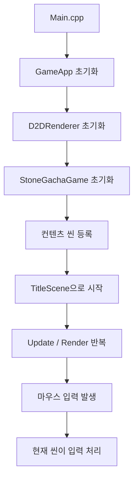
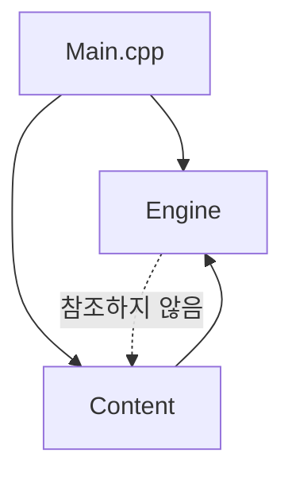

# 프로젝트 구조 설명서

이 문서는 `D2D_Engine_JAEMIN` 프로젝트를 처음 보는 사람이 전체 구조를 빠르게 이해할 수 있도록 작성한 안내서입니다.

현재 프로젝트는 크게 `Engine`과 `Content`로 나뉩니다.

- `Engine`: 게임 종류와 상관없이 재사용할 수 있는 공통 시스템
- `Content`: 이 프로젝트의 실제 게임인 "돌 파밍으로 돈을 모아 가챠로 성공" 전용 코드

중요한 원칙은 다음과 같습니다.

```text
Content는 Engine을 사용한다.
Engine은 Content를 모른다.
```

즉, 엔진은 돌, 가챠, 상점, 플레이어 돈 같은 게임 전용 개념을 알지 않습니다.

---

## 1. 전체 폴더 구조

```text
D2D_Engine_JAEMIN
├─ Main.cpp
│
├─ Engine
│  ├─ Core
│  │  ├─ GameApp.h
│  │  └─ GameApp.cpp
│  │
│  ├─ Render
│  │  ├─ D2DRenderer.h
│  │  └─ D2DRenderer.cpp
│  │
│  ├─ Scene
│  │  └─ Scene.h
│  │
│  └─ Object
│     ├─ GameObject.h
│     └─ GameObject.cpp
│
├─ Content
│  ├─ StoneGachaGame.h
│  ├─ StoneGachaGame.cpp
│  │
│  ├─ Data
│  │  └─ GameData.h
│  │
│  ├─ System
│  │  ├─ GachaSystem.h
│  │  └─ GachaSystem.cpp
│  │
│  └─ Scene
│     ├─ TitleScene.h
│     ├─ TitleScene.cpp
│     ├─ PlayScene.h
│     ├─ PlayScene.cpp
│     ├─ ShopScene.h
│     └─ ShopScene.cpp
│
└─ Resource
   └─ Images
      └─ README.md
```

---

## 2. 실행 흐름

프로그램은 다음 순서로 실행됩니다.



조금 더 코드 기준으로 보면 다음과 같습니다.

1. `Main.cpp`가 Win32 창을 만들고 메시지 루프를 실행합니다.
2. `GameApp`이 엔진 시스템을 초기화합니다.
3. `StoneGachaGame`이 자기 게임에 필요한 씬을 `GameApp`에 등록합니다.
4. `GameApp`은 현재 씬의 `Update`, `Render`, `OnMouseClick`을 호출합니다.
5. 각 씬은 자기 화면의 게임 규칙을 처리합니다.

---

## 3. Engine 폴더

`Engine`은 게임 공통 기능만 담당합니다.

엔진 코드는 `Content` 폴더의 파일을 include하지 않아야 합니다.

### 3.1 Engine/Core

```text
Engine/Core
├─ GameApp.h
└─ GameApp.cpp
```

`GameApp`은 엔진의 중심 클래스입니다.

주요 역할:

- 렌더러 초기화
- 현재 씬 관리
- 씬 등록
- 씬 전환
- 게임 루프에서 `Update`, `Render` 호출
- 마우스 클릭을 현재 씬에 전달

중요한 점은 `GameApp`이 특정 씬 클래스를 직접 생성하지 않는다는 점입니다.

예전 구조에서는 `GameApp`이 `TitleScene`, `PlayScene`, `ShopScene`을 알고 있었습니다. 지금은 컨텐츠가 씬을 등록합니다.

```cpp
app.RegisterScene(L"SceneName", [](GameApp& app)
{
    return std::make_unique<SomeScene>(app);
});
```

이 구조 덕분에 엔진은 어떤 게임이 들어오든 같은 방식으로 씬을 실행할 수 있습니다.

---

### 3.2 Engine/Render

```text
Engine/Render
├─ D2DRenderer.h
└─ D2DRenderer.cpp
```

`D2DRenderer`는 Direct2D와 DirectWrite 렌더링을 담당합니다.

주요 역할:

- Direct2D Factory 생성
- RenderTarget 생성
- DirectWrite Font 생성
- 화면 지우기
- 텍스트 그리기
- 사각형 패널 그리기
- 원/타원 그리기
- 선 그리기

컨텐츠 씬은 Direct2D COM 객체를 직접 다루지 않고 `D2DRenderer`의 함수만 사용합니다.

예시:

```cpp
renderer.Clear(D2D1::ColorF(0.70f, 0.86f, 0.72f));
renderer.DrawTextBlock(L"보유 돈: 10원", rect, TextStyle::Right, color);
```

---

### 3.3 Engine/Scene

```text
Engine/Scene
└─ Scene.h
```

`Scene`은 모든 씬이 따라야 하는 공통 인터페이스입니다.

```cpp
class Scene
{
public:
    virtual void OnEnter() {}
    virtual void Update(float deltaTime) {}
    virtual void Render(D2DRenderer& renderer) = 0;
    virtual void OnMouseClick(float x, float y) = 0;
};
```

씬이 이 인터페이스를 지키면 `GameApp`은 현재 씬이 타이틀 화면인지, 상점 화면인지 몰라도 같은 방식으로 실행할 수 있습니다.

---

### 3.4 Engine/Object

```text
Engine/Object
├─ GameObject.h
└─ GameObject.cpp
```

`GameObject`는 가장 기본적인 오브젝트 클래스입니다.

현재 기능:

- 사각형 영역 저장
- 클릭 위치가 영역 안에 있는지 검사

`ButtonObject`는 `GameObject`에 텍스트를 추가한 간단한 버튼 오브젝트입니다.

현재는 단순하지만 나중에 다음 기능을 확장할 수 있습니다.

- 위치
- 크기
- 회전
- 활성/비활성 상태
- 스프라이트 이미지
- 충돌 처리

---

## 4. Content 폴더

`Content`는 이 게임만의 규칙과 데이터를 담당합니다.

현재 컨텐츠는 "돌 파밍으로 돈을 모아 가챠로 성공" 게임입니다.

---

### 4.1 Content/StoneGachaGame

```text
Content
├─ StoneGachaGame.h
└─ StoneGachaGame.cpp
```

`StoneGachaGame`은 이 게임의 컨텐츠 루트입니다.

주요 역할:

- 플레이어 데이터 보관
- 가챠 시스템 보관
- 상태 메시지 보관
- 타이틀/플레이/상점 씬 등록
- 시작 씬 지정

씬 등록은 여기서 이루어집니다.

```cpp
app.RegisterScene(StoneGachaScenes::Title, [this](GameApp& gameApp)
{
    return std::make_unique<TitleScene>(gameApp, *this);
});
```

이 방식은 컨텐츠가 엔진에 자기 씬을 알려주는 구조입니다.
엔진은 `TitleScene`이라는 클래스 이름을 모릅니다.

---

### 4.2 Content/Data

```text
Content/Data
└─ GameData.h
```

`GameData.h`에는 이 게임 전용 데이터 구조가 들어 있습니다.

주요 구조:

- `PlayerData`
- `ItemGrade`
- `GachaItem`

`PlayerData`는 플레이어의 현재 성장 상태입니다.

```cpp
struct PlayerData
{
    int money = 0;
    int baseClickValue = 1;
    int itemBonusClickValue = 0;
    int upgradeBonusClickValue = 0;
    int gachaCost = 10;
};
```

이 데이터는 돌 가챠 게임 전용이므로 엔진에 있으면 안 됩니다.

---

### 4.3 Content/System

```text
Content/System
├─ GachaSystem.h
└─ GachaSystem.cpp
```

`GachaSystem`은 가챠 확률과 보상 추첨을 담당합니다.

주요 역할:

- 기본 가챠 데이터 로드
- 확률 기반 아이템 추첨
- 가챠 아이템 목록 제공

현재 확률:

```text
일반: 60%
희귀: 30%
영웅: 9%
전설: 1%
```

이 시스템도 돌 가챠 게임 전용이므로 `Content`에 위치합니다.

---

### 4.4 Content/Scene

```text
Content/Scene
├─ TitleScene.h / .cpp
├─ PlayScene.h / .cpp
└─ ShopScene.h / .cpp
```

이 폴더에는 실제 게임 화면들이 들어 있습니다.

#### TitleScene

타이틀 화면입니다.

주요 기능:

- 게임 제목 출력
- 제목 부유 애니메이션
- 시작 버튼
- 시작 버튼 클릭 시 플레이 씬으로 이동

#### PlayScene

돌 파밍 화면입니다.

주요 기능:

- 돌 오브젝트 출력
- 화면 클릭 시 돈 증가
- 보유 돈 UI 출력
- 클릭 수익 UI 출력
- 상점 버튼
- 상점 버튼 클릭 시 상점 씬으로 이동

중요한 규칙:

```text
상점 버튼 클릭 판정이 화면 전체 클릭 판정보다 먼저 실행되어야 한다.
```

그렇지 않으면 상점 버튼을 누를 때 돈도 같이 증가할 수 있습니다.

#### ShopScene

상점 / 가챠 화면입니다.

주요 기능:

- 상점 주인 출력
- 상점 주인 클릭 시 가챠 실행
- 가챠 비용 확인
- 돈 부족 메시지 출력
- 가챠 결과 출력
- 확률 정보 패널 열기/닫기
- 돌아가기 버튼

---

## 5. Resource 폴더

```text
Resource
└─ Images
```

이미지 리소스를 넣기 위한 폴더입니다.

현재는 실제 이미지 대신 Direct2D 도형으로 임시 스프라이트를 그리고 있습니다.

나중에 다음 파일들을 추가할 수 있습니다.

```text
title_logo.png
rock.png
shop_button.png
shop_owner.png
probability_button.png
back_button.png
result_panel.png
```

이미지를 사용하려면 `D2DRenderer`에 비트맵 로딩 기능을 추가하고, 컨텐츠 씬에서 해당 이미지를 그리도록 바꾸면 됩니다.

---

## 6. 의존 관계

현재 의존 방향은 다음과 같습니다.



정리하면 다음과 같습니다.

```text
Main.cpp
  ├─ Engine 사용
  └─ Content 사용

Content
  └─ Engine 사용

Engine
  └─ Content를 사용하지 않음
```

이 규칙을 지켜야 엔진과 컨텐츠가 분리됩니다.

---

## 7. 씬 전환 구조

씬 이름은 `Content/StoneGachaGame.h`에 정의되어 있습니다.

```cpp
namespace StoneGachaScenes
{
    constexpr const wchar_t* Title = L"StoneGacha.Title";
    constexpr const wchar_t* Play = L"StoneGacha.Play";
    constexpr const wchar_t* Shop = L"StoneGacha.Shop";
}
```

씬 전환은 다음처럼 호출합니다.

```cpp
App().ChangeScene(StoneGachaScenes::Shop);
```

`GameApp`은 문자열 이름에 해당하는 씬 생성 함수를 찾아 새 씬을 만듭니다.

---

## 8. 새 씬 추가 방법

예를 들어 인벤토리 씬을 추가하고 싶다면 다음 순서로 작업하면 됩니다.

1. `Content/Scene/InventoryScene.h` 생성
2. `Content/Scene/InventoryScene.cpp` 생성
3. `InventoryScene`이 `Scene`을 상속하도록 작성
4. `StoneGachaGame.h`에 씬 이름 추가
5. `StoneGachaGame.cpp`에서 `RegisterScene` 호출
6. 필요한 버튼에서 `App().ChangeScene()` 호출
7. `.vcxproj`와 `.vcxproj.filters`에 새 파일 추가

예시:

```cpp
app.RegisterScene(StoneGachaScenes::Inventory, [this](GameApp& gameApp)
{
    return std::make_unique<InventoryScene>(gameApp, *this);
});
```

---

## 9. 새 컨텐츠 게임 추가 방법

현재는 `StoneGachaGame` 하나만 있습니다.

나중에 완전히 다른 게임 컨텐츠를 추가하려면 다음처럼 만들 수 있습니다.

```text
Content
├─ StoneGachaGame
└─ OtherGame
```

새 컨텐츠는 엔진을 그대로 사용하면서 자기 데이터와 씬만 따로 등록하면 됩니다.

핵심은 다음과 같습니다.

```cpp
OtherGame otherGame;
otherGame.Initialize(gameApp);
```

이때 엔진 코드는 수정하지 않아도 됩니다.

---

## 10. 빌드 정보

Visual Studio 프로젝트 파일:

```text
D2D_Engine_JAEMIN/D2D_Engine_JAEMIN.vcxproj
```

현재 확인한 빌드 구성:

```text
Configuration: Debug
Platform: x64
```

빌드 결과 실행 파일:

```text
x64/Debug/D2D_Engine_JAEMIN.exe
```

---

## 11. 현재 구현된 게임 기능

현재 구현된 최소 완성 기능은 다음과 같습니다.

- 타이틀 화면 출력
- 타이틀 텍스트 부유 애니메이션
- 시작 버튼
- 돌 파밍 씬
- 화면 클릭 시 돈 증가
- 상점 버튼
- 상점 씬
- 상점 주인 클릭 시 가챠 실행
- 돈 부족 메시지
- 가챠 결과 메시지
- 가챠 아이템 효과로 클릭 수익 증가
- 확률 정보 패널
- 돌아가기 버튼

---

## 12. 개발 시 주의사항

엔진과 컨텐츠를 분리하기 위해 다음 규칙을 지켜야 합니다.

1. `Engine` 폴더에서 `Content` 폴더의 헤더를 include하지 않습니다.
2. `Engine`에는 특정 게임 이름, 아이템 이름, 가챠 확률 같은 데이터를 넣지 않습니다.
3. 게임 전용 데이터는 `Content/Data`에 둡니다.
4. 게임 전용 시스템은 `Content/System`에 둡니다.
5. 게임 전용 화면은 `Content/Scene`에 둡니다.
6. 공통 렌더링, 공통 오브젝트, 공통 씬 인터페이스만 `Engine`에 둡니다.
7. 새 파일을 만들면 `.vcxproj`와 `.vcxproj.filters`에도 추가해야 Visual Studio 빌드에 포함됩니다.

이 규칙을 지키면 엔진은 재사용 가능하고, 컨텐츠는 독립적으로 확장할 수 있습니다.
